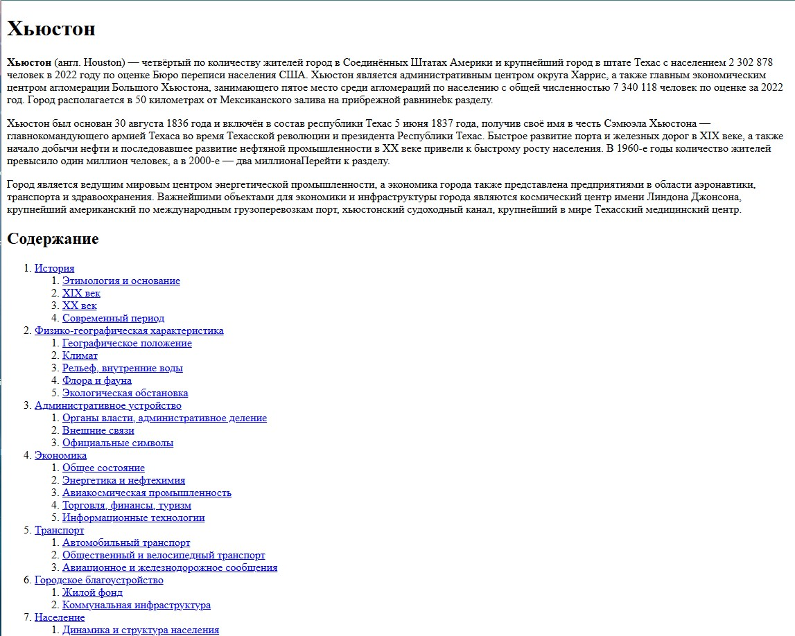

# Houston Page

Учебная HTML-страница: вёрстка статьи из Википедии.

## Что в репозитории
- `index.html` — основная страница.
- `img/` — папка с изображениями.

## Скриншот


Полную страницу можно посмотреть здесь: 
https://malinirs.github.io/houston-page/

## Как запустить
1. Склонировать репозиторий:
   ```bash
   git clone https://github.com/malinirs/houston-page.git
2. Открыть файл `index.html` в браузере.
